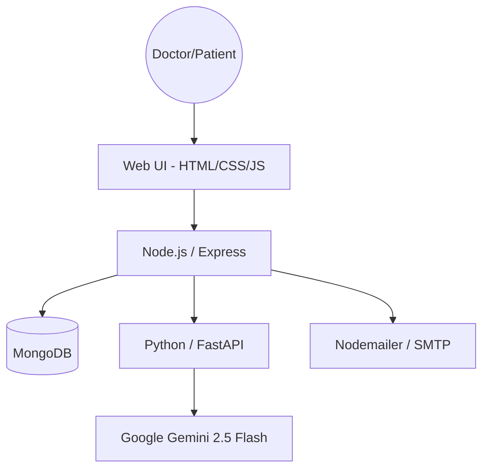

# 🏥 Arogya-Vahini (Health-Flow)


> **Empowering Healthcare with Intelligent Diagnostics & Seamless Connectivity.**

Arogya-Vahini is a premium, AI-driven healthcare management ecosystem designed to bridge the gap between doctors, patients, and clinical insights. Built with a focus on high-performance aesthetics and cutting-edge Gemini 2.5 AI, it provides a "clinical co-pilot" experience for modern medical practices.

---

## ✨ Key Features

### 🤖 Clinical AI Co-Pilot (ArogyaBot)
*   **Database Intelligence**: Analyzes the entire patient database to provide population-level trends, blood group distribution, and age demographics.
*   **Predictive Diagnostics**: Automatically generates "AI Clinical Summaries" by correlating patient symptoms with uploaded medical reports.
*   **Real-time Assistance**: Answers medical research queries and clarifies clinical notes instantly.

### 📋 Doctor Management Suite
*   **Smart Dashboard**: A high-density overview of patient records, live notifications, and hospital referrals.
*   **One-Click Share**: Send beautifully themed medical records directly to a patient's email, including an optional AI-generated clinical briefing.
*   **Hospital Referral System**: Integrated map and QR-code scanner for rapid patient transfers between facilities.

### 📈 Patient Empowerment
*   **Health Vault**: Secure access to medical records, symptoms history, and uploaded reports.
*   **Interactive Insights**: Health vitals visualized through dynamic charts and risk-level badges (High/Medium/Low).
*   **Mobile-Ready**: Responsive glassmorphism UI that works everywhere.

---

## 🛠️ Tech Stack

| Component | Technology |
| :--- | :--- |
| **Frontend** | HTML5, CSS3 (Glassmorphism), JavaScript (Vanilla), Remix Icons |
| **Backend API** | Node.js, Express, Mongoose, Nodemailer |
| **AI Engine** | Python, FastAPI, Google Gemini 2.5 Flash |
| **Database** | MongoDB |
| **Real-time** | QR Code Integration, Leaflet.js (Maps) |

---

## 🚀 Installation & Setup

### 1. Prerequisites
*   Node.js (v16+)
*   Python (3.9+)
*   MongoDB Atlas or local instance
*   Google Gemini API Key

### 2. Backend Setup
```bash
cd backend
npm install
# Create a .env file with:
# MONGO_URI, JWT_SECRET, EMAIL_USER, EMAIL_PASS
npm start
```

### 3. AI Service Setup (Diagnostics Engine)
```bash
cd ai-service
pip install -r requirements.txt
# Create a .env file with:
# GEMINI_API_KEY=your_key_here
uvicorn app:app --reload --port 8000
```

### 4. Frontend
Simply open `frontend/pages/login.html` via **Live Server** or any static host.

---

## 📐 System Architecture



---

## 🎨 Design Philosophy
Arogya-Vahini uses a custom **"Arogya Gold & Dark Slate"** theme. We prioritize:
- **Clarity**: High-contrast clinical data.
- **Urgency**: Risk-based color coding (High/Medium/Low).
- **Elegance**: Smooth animations and blurred glass surfaces for a premium medical feel.

---

## 📄 License
This project is developed for the **Hackaura Hackathon**. All rights reserved.

---
*Developed with ❤️ by Team Arogya.*
